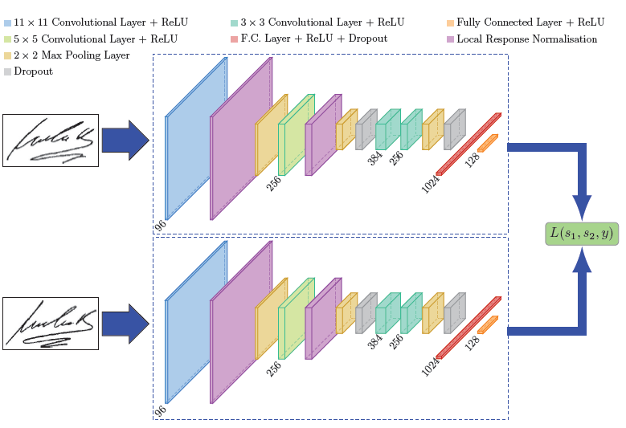
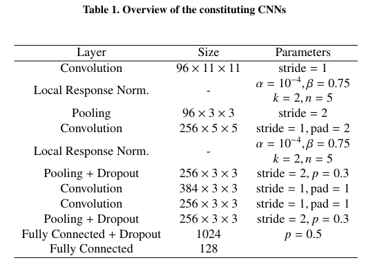
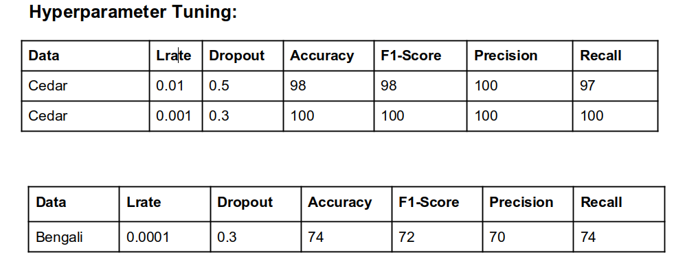
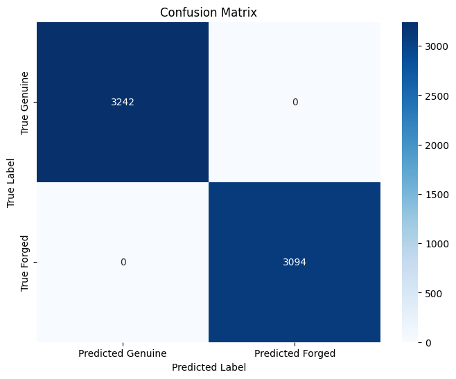
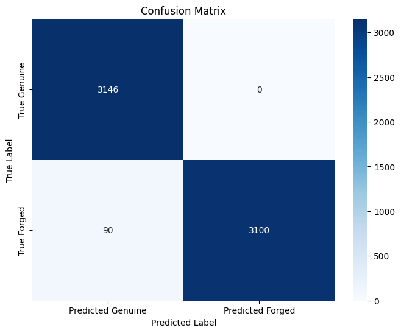
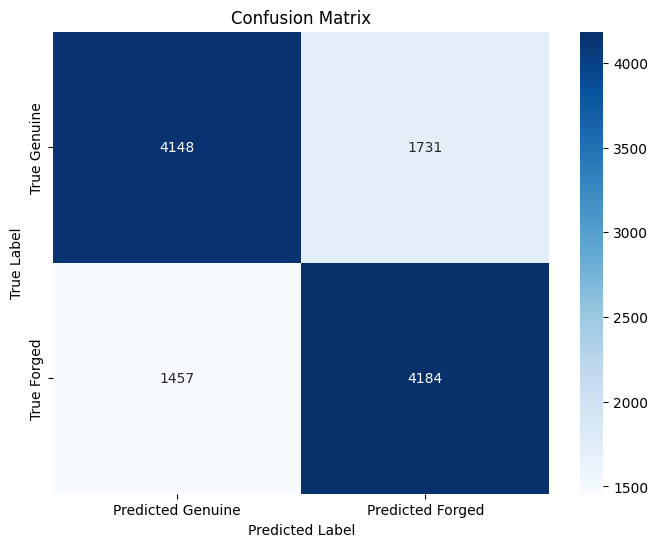

# Signature Verification model using Siamese Neural Networks

**Problem Statement**
Create a machine learning model capable of distinguishing between genuine and forged handwritten signatures. Given a dataset of signature images, the model should be trained to return the match percentage between the two input signatures.

**In this repo, you will find :** 
- Data Insights
- Adopted Approach
- Data Preparation and Processing
- Model Architecture
- Results
- References

### Data Insights
Three benchmark datasets containing offline handwritten genuine and forged signatures. 
- CEDAR
- BHSig260 Bengali
- BHSig260 Hindi
Here is the link to the dataset: [Kaggle Dataset](https://www.kaggle.com/datasets/ishanikathuria/handwritten-signature-datasets)

### Adopted Approach
Upon initial investigation into the task of distinguishing between two signatures, the idea of employing a CNN-based architecture swiftly came to mind. I encountered Siamese Neural Networks, which are particularly adept at handling pair data—a fitting solution for our task. In alignment with my problem statement, I came across a research paper that outlined a methodology closely suited to my use case. 

### Data Preparation and Processing
For preparing the data, I splitted the data into a **60-20-20** train-val-test split. For data preprocessing, I had thought of creating batches to feed to my model. So I deployed the following steps while making the batches itself:
- Resizing
- Normalising
- Grayscale Conversion

###### Note: 
Rather than processing the data before batching, I did it while doing the batching process. So, that is why, you won’t find any explicit data processing steps.

### Model Architecture
I have essentially replicated the model architecture from the research paper.

### Results
Due to GPU dependency, I have only trained models for CEDAR and Bengali Data. 
- Bengali Data gave only 72% accuracy but if we have good compute, we can tune it easily to **85-90%** range.
- CEDAR Data has 100% accuracy.

**Confusion Metrices**
1. Best Cedar Model

2. Other Models

### References
- https://arxiv.org/pdf/1707.02131
- https://github.com/netrapathak/Offline-Signature-Verification

